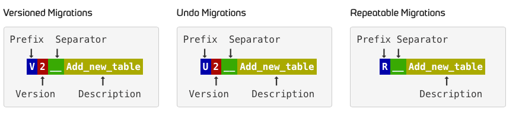

# Flyway

## 1. 학습 목적
Flyway는 데이터베이스의 스키마 이력을 관리하고 마이그레이션을 자동화할 수 있는 도구이다. 이를 학습하는 주요 목적은 다음과 같다

- **데이터베이스 버전 관리**: 프로젝트의 데이터베이스 스키마 변경을 안전하게 추적하고 관리할 수 있다.
- **자동화된 마이그레이션**: 애플리케이션 배포 시 데이터베이스 스키마 변경을 자동으로 적용하여 일관된 배포 환경을 유지한다.
- **협업 효율성 향상**: 여러 개발자 또는 팀이 작업할 때 데이터베이스 변경 사항을 쉽게 공유하고 충돌을 방지한다.
- **DevOps 프로세스 통합**: CI/CD 파이프라인에서 데이터베이스 마이그레이션을 자동으로 처리하여 배포 작업을 단순화한다.

나는 회사에서 주로 JAVA, Spring boot, JPA 로 개발을 진행해 왔다. <br>
그러다 보니 로컬에서는 스키마를 변경하였지만 실제 테스트 DB서버에는 적용하지 않아 오류를 일으키는 문제가 발생하였다. <br>
이를 방지할 목적으로 여러 방법을 찾아보다가 Flyway라는 도구를 알게 되어 실제 프로젝트에 적용하였다. <br>
Flyway를 적용하는 문서를 남기려고 한다.

## 2. 정의
Flyway는 **오픈 소스 데이터베이스 마이그레이션 도구**로, SQL 기반의 스크립트를 통해 데이터베이스 스키마 버전 관리를 자동화한다. <br>
Flyway는 데이터베이스 변경 사항을 추적하고 관리하며, 마이그레이션이 필요한 경우 스크립트를 실행하여 데이터베이스 스키마를 최신 상태로 유지한다.

주요 특징:
- **SQL 기반 마이그레이션**: SQL 스크립트 파일로 스키마 변경을 정의한다.
- **자동 버전 관리**: 스키마 변경 사항이 자동으로 관리되며, 버전 번호를 기준으로 순차적으로 적용된다.
- **다양한 데이터베이스 지원**: Flyway는 MySQL, PostgreSQL, Oracle, SQL Server 등 여러 데이터베이스를 지원한다.

## 3. 도입 방법
Flyway를 프로젝트에 도입하는 방법은 간단합니다. 일반적으로 Spring Boot 프로젝트와 같이 사용되며, 아래 단계로 도입할 수 있다.

### 3.1. Flyway 설정
1. **Maven 또는 Gradle에 의존성 추가**:
   ```xml
   <!-- Maven -->
   <dependency>
       <groupId>org.flywaydb</groupId>
       <artifactId>flyway-core</artifactId>
   </dependency>
   ```
   ```groovy
   // Gradle
   implementation 'org.flywaydb:flyway-core'
   ```
2. **Flyway 활성화**
    ```yml
   # yml
   spring:
      flyway:
        enabled: true
   ```
   위 설정을 추가하여 Spring Boot에서 Flyway를 활성화 한다.

3. **첫번째 마이그레이션 스크립트 작성**:
   `src/main/resources/db/migration` 경로에 SQL 마이그레이션 파일을 작성한다. 파일 이름은 `V1__Initial_setup.sql` 형식으로 버전을 포함해야 한다. 이때, **언더스코어**(**`_`**)**가 2개임을 주의**한다.

    ```sql
    CREATE TABLE users (
        id BIGINT AUTO_INCREMENT,
        name VARCHAR(255),
        email VARCHAR(255),
        password VARCHAR(255),
        PRIMARY KEY (id)
    );
    ```
4. **Flyway 자동 마이그레이션 실행**:
   애플리케이션이 시작될 때 Flyway가 자동으로 마이그레이션을 실행한다.

### 3.2   **JPA 엔티티 구조 변경**
프로젝트를 지속적으로 개발하면서, 회원가입 시 나이 정보도 제공받게 되었다. JPA 엔티티 구조는 아래와 같이 변경된다.

    ```java
    @Entity
    public class Users {
    
        @Id
        @GeneratedValue(strategy = GenerationType.IDENTITY)
        private Long id;
    
        private String name;
        private String email;
        private String password;
        private Integer age; // 필드 추가
    ```
### 3.3. **새로운 버전의 마이그레이션 스크립트 작성**

새로운 버전의 마이그레이션 스크립트를 생성하여, 현재 데이터베이스 테이블의 스키마를 엔티티와 일치하도록 만들어보자. **`V2__add_age.sql`** 라는 이름으로 동일하게 **`src/main/resources/db/migration`** 디렉토리에 추가하고, 아래의 내용을 채워넣자.

```sql
ALTER TABLE users ADD COLUMN age int;
```

### 3.4. **마이그레이션 명명 규칙**



기본적으로 Flyway의 마이그레이션 스크립트의 파일 이름 명명법은 위를 따른다. **숫자가 작은 버전의 마이그레이션부터 숫자가 큰 버전 순서대로 스크립트가 실행**된다.

단, 버전은 정수로 인식되므로 **`3.10`** 과 **`3.2`** 중 **`3.2`** 가 먼저 실행됨을 주의해야한다.

### 3.5. **버전이 지정된 마이그레이션**

마이그레이션 스크립트의 최신 버전과 현재 데이터베이스의 스키마 버전을 비교하고, **차이점이 있다면 마이그레이션 스크립트를 순차적으로 실행하여 최신 스키마와 격차를 좁혀** 나간다.

최신 마이그레이션 버전의 숫자보다 작은 숫자의 버전으로 마이그레이션 스크립트를 추가한다면, 그 마이그레이션 스크립트는 무시된다. 예를 들어 최신 버전이 **`V5`** 인데, **`V4`** 를 이후에 추가하는 경우입니다. 즉, 마이그레이션 스크립트를 추가할 때에는 **항상 최신 마이그레이션 스크립트의 버전보다 큰 숫자로 버전을 설정**해야한다.

### 3.6. **Undo Migrations**

이 기능은 Flyway Teams 라는 유료 버전에서만 사용할 수 있다. Undo 사용시 주의해야 한다. ([참고](https://flywaydb.org/documentation/command/undo)).

### 3.7. **Repeatable Migrations**

모든 마이그레이션 스크립트가 실행된 이후 실행되는 스크립트다. Repeatable Migrations 끼리는 description 순서대로 실행된다. **한번 실행되며, 파일이 변경되어 체크섬이 변경되면 또 실행**된다.

### 3.8. **flyway_schema_history**
데이터베이스를 확인해보면, 우리가 생성하지 않은 테이블이 하나 생성된 것을 확인할 수 있다. **`flyway_schema_history`** 라는 이름의 테이블인데요, Flyway는 이 테이블을 사용하여, 마이그레이션에 대한 버전 관리를 한다. <br> 
한번 **`V2__add_age.sql`** 을 제거하고, **`V1__init.sql`** 에 **`age`** 컬럼을 추가해보자 **`V1__init.sql`** 을 아래와 같이 변경하고, 애플리케이션을 실행해보자.

```sql
CREATE TABLE member (
    id BIGINT AUTO_INCREMENT,
    name VARCHAR(255),
    email VARCHAR(255),
    password VARCHAR(255),
    age int,
    PRIMARY KEY (id)
);
```

Flyway에서 아래와 같은 에러가 발생할 것이다.

```
Caused by: org.flywaydb.core.api.exception.FlywayValidateException: Validate failed: Migrations have failed validation
Migration checksum mismatch for migration version 1
-> Applied to database : -714805521
-> Resolved locally    : 1143495658
Either revert the changes to the migration, or run repair to update the schema history.
```

Flyway는 각 마이그레이션 스크립트 별로 체크섬을 비교하여 유효성을 검사한다. 따라서, 스키마에 대한 모든 변경은 반드시 새로운 버전의 마이그레이션 스크립트를 추가하는 방법으로 진행해야한다.


### 3.9. Flyway CLI 사용
Flyway CLI를 사용하여 독립적인 데이터베이스 마이그레이션을 수행할 수도 있다. 다음은 기본적인 도입 절차이다:
1. **Flyway CLI 다운로드**: Flyway 웹사이트에서 CLI를 다운로드하여 설치한다.
2. **설정 파일 작성**: 데이터베이스 설정을 포함하는 `flyway.conf` 파일을 작성한다.
3. **마이그레이션 파일 작성**: SQL 스크립트를 작성하여 마이그레이션을 준비한다.
4. **명령 실행**: Flyway CLI에서 `flyway migrate` 명령을 실행하여 데이터베이스 마이그레이션을 적용한다.

## 4. 효과
Flyway를 도입하면 다음과 같은 효과를 기대할 수 있다:

- **데이터베이스 일관성 보장**: 모든 개발 환경과 운영 환경에서 동일한 데이터베이스 스키마 상태를 유지할 수 있다.
- **배포 과정 간소화**: 데이터베이스 마이그레이션이 자동으로 처리되므로 배포 과정에서 발생할 수 있는 오류를 최소화한다.
- **효율적인 스키마 관리**: 변경 사항을 추적하고 쉽게 롤백할 수 있는 기능을 제공하여 스키마 관리가 쉬워진다.
- **협업 강화**: 팀원 간 데이터베이스 변경 사항을 쉽게 공유할 수 있어 협업이 강화된다.
- **DevOps 통합**: CI/CD 파이프라인에 통합되어, 자동화된 배포 프로세스를 구축할 수 있다.

---

## 5. 도입후기
Flyway를 도입한 후 스키마 변경에 대한 오류 발생 빈도가 굉장히 줄어들었다. <br>
발주사에서도 DB 변경 스크립트 히스토리가 있어 유지보수에 편리할 것 같다고 피드백을 받았다.