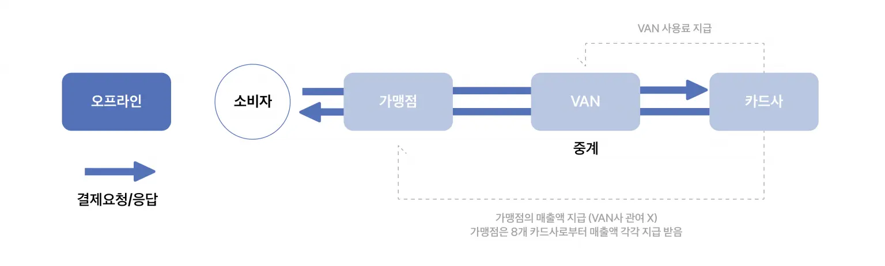
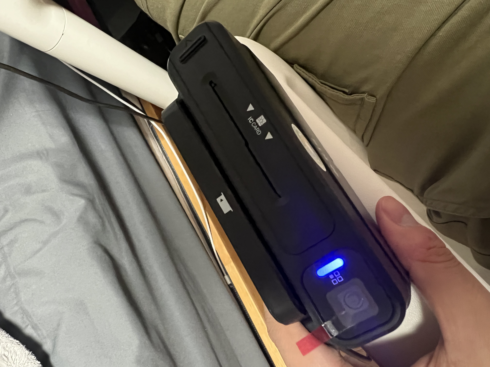

# 오프라인 결제

## 개요
나는 여러 쇼핑몰의 결제를 연동(페이코, KCP, 엑심베이)하고 직접 PG 플랫폼을 개발해 본 경험이 있다.  
문서를 보면서 결제에 필요한 파라미터를 확인하고, 결제 요청을 보내고, 응답을 받아 처리하는 과정을 진행하였다.  
물론 PG 플랫폼을 개발할 때 페이코, 엑심베이, KCP 의 역할이 되어 결제 시스템을 만들었다.  
하지만 한번도 카드 리더기를 통한 오프라인 결제를 경험해보지 못했다.  
최근에 지인을 통해 인생네컷 같은 프로젝트를 진행하면서 카드 리더기를 통한 오프라인 결제를 경험해보았다.  

## 오프라인 결제란?
오프라인 결제는 온라인이 아닌 실제 매장에서 결제하는 방식을 말한다.  
오프라인 결제는 카드 리더기를 통해 결제를 진행하며, 카드 리더기는 카드 정보를 읽어 결제를 진행한다.  
하지만 우리가 결제 프로세스르 보면 VAN, PG 라는 것을 알아야 한다.  
  
출처 : TOSS

## VAN이란?

VAN(부가가치통신망, Value Added Network)은 데이터 통신망을 통해 정보를 부가적으로 처리하거나 전달하여 부가가치를 창출하는 네트워크 서비스다.   
일반적으로 전자결제 시스템에서 많이 언급되며, 결제와 관련된 데이터 중계를 담당한다.  
오프라인 매장에서 입력한 고객의 결제 데이터를 카드사로 안전하게 보내주는 역할을 한다.   
결제 정보를 주고받는 일종의 ‘파이프’ 역할을 한다고 생각할 수 있다.

## PG란?
온라인 결제의 핵심, PG는 Payments Gateway의 준말로 ‘결제를 위한 관문’이란 뜻이다.   
신용카드사와 직접 계약하기 어려운 온라인 쇼핑몰을 대신해 결제 업무를 대신해 주는 역할을 한다.

## 카드 리더기를 구매하자
오프라인 결제를 하기 위해 여러 업체를 알아보았고 그 중 가장 많은 정보를 제공해 주는 KIS-정보통신의 카드리더기를 구매하였다.  
  
위와 같이 카드리더기를 통해 카드 정보를 읽어 결제를 진행할 수 있다.  

## 카드 리더기를 통한 결제 프로세스
카드 리더기를 통한 결제 프로세스는 다음과 같다.  
1. KIS 정보통신에서 제공하는 프로그램을 설치한다.
2. 카드 리더기를 USB 포트에 연결한다.
3. 카드 리더기와 KIS Agent 프로그램과 연동한다.
4. 웹소켓과 KIS Agent 프로그램을 연동한다.
5. 카드 리더기를 통해 카드 정보를 읽어 결제를 진행한다.

## 실제 연동 영상
<video width="320" height="240" controls>
  <source src="../video/van.mp4" type="video/mp4">
</video>