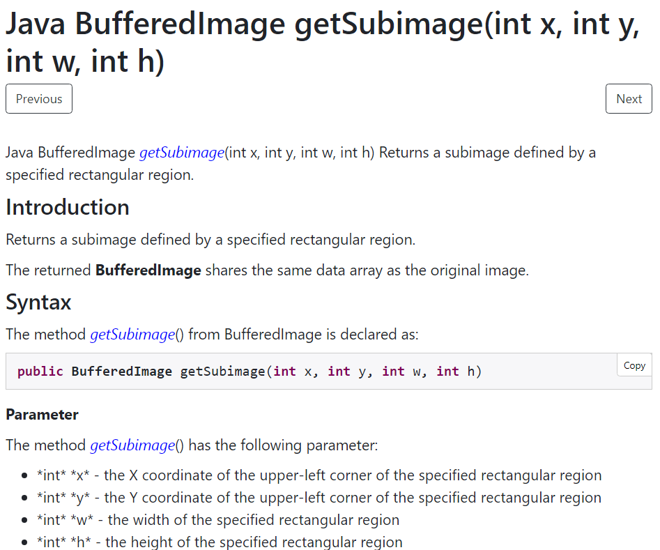
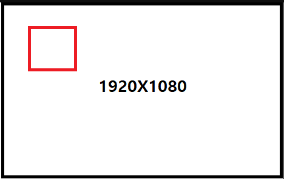

# 이미지 편집시 이미지가 회전되는 문제

배민로봇이라는 프로젝트를 완료 후 실제 서비스를 배포하였다. <br>
배민로봇의 주요기능 중 하나가 사장님이 직접 이미지를 편집하여 로봇에 전송하는 기능이다. <br>
배민로봇을 사용하시는 사장님들은 이미지를 편집하여 로봇에 전송하는데, 이때 이미지가 회전되는 문제가 발생하였다. <br>
모든 케이스에서 발생하는 일은 아니었고 특정 케이스에서만 발생하였다. <br>

먼저 이미지가 회전되는 문제를 알기 위해서는 먼저 이미지를 편집하는 기능에 대해 먼저 알아야 한다. <br>

## 이미지 편집 기능

이미지에서 원하는 부분만 잘라내고 싶을 때는 **BufferedImage.getSubimage** 메소드를 사용하면 아래 설명을 참고해서 쉽게 이미지 자르기를 해보자.
### 1. **getSubimage** 파라미터 설명

먼저, `getSubimage(int x, int y, int w, int h)` 이 메소드는 네 개의 파라미터를 받아서, 잘라낼 사각형 영역을 지정한다.

- **x**: 자르려는 이미지의 좌측 상단 모서리의 x 좌표
- **y**: 자르려는 이미지의 좌측 상단 모서리의 y 좌표
- **w**: 자르려는 이미지의 가로 길이 (너비)
- **h**: 자르려는 이미지의 세로 길이 (높이)



### 2. 예외 사항 (outside Raster 오류)

자르고 싶은 이미지의 **w**와 **h** 값이 원본 이미지 크기(예: 1920x1080)를 벗어나면 **outside Raster** 오류가 발생할 수 있어. <br> 
그래서 정확한 크기를 알고 있으면 그 값을 넣으면 되고, 모서리부터 끝까지 자르고 싶다면 다음 방법을 쓰면 돼:

- **w** = 원본 이미지의 너비 - x 좌표
- **h** = 원본 이미지의 높이 - y 좌표

이렇게 하면 이미지의 끝부분까지 자를 수 있다.



### 3. 간단한 코드 예시

```java
import java.awt.image.BufferedImage;
import javax.imageio.ImageIO;
import java.io.File;

BufferedImage buff = ImageIO.read(new File(file));

BufferedImage new_buff = buff.getSubimage(minX, minY, (maxX-minX), (maxY-minY));
```

## 이미지 회전 문제

위의 형식대로 이미지를 자르면 보통 문제가 생기지 않았다. <br>
그런데 일부 휴대폰에서 찍은 사진이 편집되면 이미지가 회전되는 문제가 발생하였다. <br>
회전이 발생한 사진을 원본을 입수 한후 분석에 들어갔다. <br>
이후 사진의 정보를 분석한 후 메타데이터 회전 정보를 확인해 보니 문제를 발견할 수 있었다. <br>

```java
// 1. 원본 파일을 읽는다.
// 2. 원본 파일의 Orientation 정보를 읽는다.
// 3. 변경할 값들을 설정한다.
// 4. 회전하여 생성할 파일을 만든다.
// 5. 원본파일을 회전하여 파일을 저장한다.

// 1. 원본 파일을 읽는다.
File imageFile =new File("D:/o6.jpg");

// 2. 원본 파일의 Orientation 정보를 읽는다.
int orientation = 1; // 회전정보, 1. 0도, 3. 180도, 6. 270도, 8. 90도 회전한 정보
int width = 0; // 이미지의 가로폭
int height = 0; // 이미지의 세로높이
int tempWidth = 0; // 이미지 가로, 세로 교차를 위한 임의 변수

Metadata metadata; // 이미지 메타 데이터 객체
Directory directory; // 이미지의 Exif 데이터를 읽기 위한 객체
JpegDirectory jpegDirectory; // JPG 이미지 정보를 읽기 위한 객체

try {
    metadata = ImageMetadataReader.readMetadata(imageFile);
    directory = metadata.getFirstDirectoryOfType(ExifIFD0Directory.class);
    jpegDirectory = metadata.getFirstDirectoryOfType(JpegDirectory.class);
    if(directory !=null){
        orientation = directory.getInt(ExifIFD0Directory.TAG_ORIENTATION); // 회전정보
        width = jpegDirectory.getImageWidth(); // 가로
        height = jpegDirectory.getImageHeight(); // 세로
	}

    // 3. 변경할 값들을 설정한다.
    AffineTransform atf =new AffineTransform();
	switch (orientation) {
        case 1:
        break;
        case 2: // Flip X
            atf.scale(-1.0, 1.0);
	    	atf.translate(-width, 0);
	        break;
        case 3: // PI rotation
            atf.translate(width, height);
	    	atf.rotate(Math.PI);
	        break;
        case 4: // Flip Y
            atf.scale(1.0, -1.0);
	    	atf.translate(0, -height);
	        break;
        case 5: // - PI/2 and Flip X
            atf.rotate(-Math.PI / 2);
	    	atf.scale(-1.0, 1.0);
	        break;
        case 6: // -PI/2 and -width
            atf.translate(height, 0);
	    	atf.rotate(Math.PI / 2);
	        break;
        case 7: // PI/2 and Flip
            atf.scale(-1.0, 1.0);
	    	atf.translate(-height, 0);
	    	atf.translate(0, width);
	    	atf.rotate(  3 * Math.PI / 2);
	        break;
        case 8: // PI / 2
            atf.translate(0, width);
	    	atf.rotate(  3 * Math.PI / 2);
	        break;
    }

    switch (orientation) {
        case 5:
        case 6:
        case 7:
        case 8:
        tempWidth = width;
        width = height;
        height = tempWidth;
		break;
    }
                
}catch (ImageProcessingException e) {
        e.printStackTrace();
}catch (MetadataException e) {
        e.printStackTrace();
}catch (IOException e) {
        e.printStackTrace();
}
    
```

위의 코드를 통해 이미지 회전 정보를 확인하고 회전을 하여 이미지를 저장하였다. <br>
즉, 메타데이터 정보를 확인하여 이미지를 회전시켜 저장하였다. <br>
이후 이미지를 편집하였을 때 이미지가 회전되는 문제를 해결할 수 있었다. <br>

